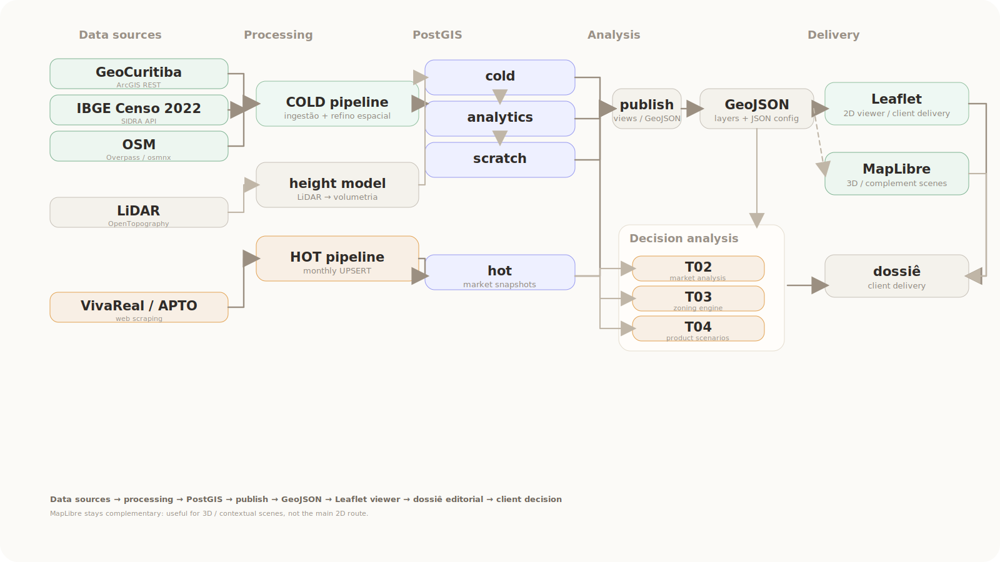

# Camões 172 — Urban Intelligence Pipeline

> End-to-end geospatial data system for real estate product decisions.  
> From raw municipal data to interactive client delivery — built as the technical foundation of [Ombu Lab](https://www.instagram.com/ombu_lab/), a territorial intelligence consultancy in Curitiba, Brazil.

**Stack:** Python · PostGIS · GeoPandas · MapLibre GL JS · GeoParquet · IBGE SIDRA API · GeoCuritiba (ArcGIS REST) · OSM Overpass · LiDAR

---

## System flow



---

## Table of Contents

1. [Spatial Database Design](#1-spatial-database-design)
2. [Pipeline Engineering](#2-pipeline-engineering)
3. [Geospatial Integration](#3-geospatial-integration)
4. [WebGIS & Client Delivery](#4-webgis--client-delivery)
5. [Urban & Real Estate Intelligence](#5-urban--real-estate-intelligence)

---

## 1. Spatial Database Design

**Case study · 2026**

The database separates data by function across five PostGIS schemas — a pattern that keeps ingestion, reference data, and analysis fully independent. Spatial layers live in `cold`, dynamic market listings in `hot`, study-area extracts in `scratch`, derived analytics in `analytics`, and the parametric zoning engine in `t03`.

Two different strategies handle table updates, chosen by data type:

- **Listings** (`hot` schema): UPSERT on `(snapshot_id, listing_hash)`. Monthly market snapshots accumulate without duplicates. A contract check fails fast before any write reaches the database.
- **Geospatial layers** (`cold`/`scratch`): `DROP TABLE CASCADE` + full replace. Safer for layers with dependent views — dependencies are documented and recreated explicitly.

<
>

```sql
-- Zone code normalization: raw municipal codes → standard analytical zones.
-- Handles variants like ZR3.1, ZR3.1.Y, ZR3.2 → all resolve to ZR3.
-- Critical for the parametric zoning engine (T03) to match legislation correctly.

CREATE TABLE IF NOT EXISTS t03.zone_code_map (
    raw_zone        TEXT PRIMARY KEY,
    normalized_zone TEXT NOT NULL
);

INSERT INTO t03.zone_code_map (raw_zone, normalized_zone) VALUES
    ('ZR3.1',   'ZR3'), ('ZR3.1.Y', 'ZR3'), ('ZR3.2',  'ZR3'), ('ZR3',   'ZR3'),
    ('ZR3-T',   'ZR3-T'), ('ZR3-T.1', 'ZR3-T'),
    ('ZR1',     'ZR1'), ('ZR2', 'ZR2'), ('ZR4', 'ZR4'),
    ('ZC',      'ZC'),  ('EE',  'EE'),  ('ZUE', 'ZUE'),
    ('ZR4-LV',  'ZR4-LV'), ('EE-4', 'EE-4'), ('EE-5', 'EE-5')
ON CONFLICT (raw_zone) DO UPDATE SET normalized_zone = EXCLUDED.normalized_zone;
```

```python
def drop_table_cascade(engine, schema: str, table_name: str):
    """
    DROP TABLE IF EXISTS schema.table CASCADE.
    Used before to_postgis for geospatial layers only — never for listings tables.
    Listings use UPSERT; replacing them would destroy historical market snapshots.
    """
    with engine.begin() as conn:
        conn.execute(text(f'DROP TABLE IF EXISTS "{schema}"."{table_name}" CASCADE'))


def _ensure_listings_columns(df: pd.DataFrame):
    """
    Contract check before any write: require snapshot_id and listing_hash,
    with zero nulls and zero duplicates. Fail fast — never silently corrupt
    the monthly market history.
    """
    for col in ["snapshot_id", "listing_hash"]:
        if col not in df.columns:
            raise ValueError(f"Missing required column for snapshot contract: {col}")
    if df["snapshot_id"].isna().any():
        raise ValueError("snapshot_id contains nulls")

    dup = df.duplicated(subset=["snapshot_id", "listing_hash"]).sum()
    if dup > 0:
        raise ValueError(f"Duplicate (snapshot_id, listing_hash) before upload: {int(dup)}")
```

---

## 2. Pipeline Engineering

**Case study · 2026**

Pipeline Engineering
Case study · 2026
The HOT pipeline processes real estate listings through six explicit phases — each with a contract defining what it reads, what it writes, and what it is forbidden to do. No phase enriches data that belongs to a later phase. Geocoding, for example, is phase 04: it adds coordinates but is explicitly forbidden from creating geometry columns, running spatial metrics, or deduplicating records.

Data collection happens in two paths depending on coverage scope. For targeted listings, a Selenium-based scraper (VivaRealSeleniumScraper) handles specific flows — though VivaReal's Cloudflare protection makes this unreliable for city-wide collection. For full-city coverage and new developments, collection runs through Bright Data Web Unlocker: the browser session runs on Bright Data's infrastructure, and the pipeline receives clean HTML back via HTTP, parsed with BeautifulSoup. 

Raw output lands in R2 object storage as versioned Parquet files with .meta.yaml sidecar manifests. This decouples collection from processing entirely: the ETL pipeline never needs to re-scrape to reprocess. The GitHub Actions workflow (hot-full-pipeline.yml) runs on manual dispatch with explicit inputs — month reference, geocoding toggle, write confirmation — pulling RAW from R2 and running phases 03 through 06. Idempotent by design: running it twice on the same RAW produces the same PostGIS state.

Address geocoding uses a candidate fallback strategy: if the most specific address fails, it retries with progressively simpler versions — from full address with street number down to city + state only. A deterministic cache key format ensures results are reused across runs without duplicating API calls.

<
>

```python
def build_address_candidates_from_row(row: pd.Series, source: str) -> list[str]:
    """
    Build address candidates from most-specific to most-stable.
    Tried in order until geocoding succeeds or all candidates are exhausted.

    Strategy:
    1. Full address (street + neighborhood + city + state)
    2. Address without street number
    3. City + state only (fallback anchor for cache reuse)
    4. Legacy cache-key format (backward compatibility across pipeline runs)
    """
    candidates: list[str] = []

    # Most specific: full address
    candidates.append(build_address_from_row(row, source, include_endereco=True))
    # Without street: more stable for ambiguous listings
    candidates.append(build_address_from_row(row, source, include_endereco=False))

    # City-level fallback
    city_parts = []
    if pd.notna(row.get('cidade')):
        city_parts.append(str(row['cidade']))
    if pd.notna(row.get('estado')):
        city_parts.append(str(row['estado']))
    if city_parts:
        city_parts.append('Brazil')
        candidates.append(', '.join(city_parts))

    # Legacy key format — keeps cache hits across pipeline versions:
    # "bairro, , cidade, estado, brazil" (double comma preserves empty endereco slot)
    bairro = str(row.get('bairro', '')).strip()
    cidade = str(row.get('cidade', '')).strip()
    estado = str(row.get('estado', '')).strip()
    if bairro and cidade and estado:
        candidates.append(f"{bairro}, , {cidade}, {estado}, Brazil")
        candidates.append(f"{bairro}, {cidade}, {estado}, Brazil")

    # Deduplicate preserving order
    seen: set[str] = set()
    deduped: list[str] = []
    for candidate in candidates:
        key = normalize_address_key(candidate.strip())
        if key and key not in seen:
            seen.add(key)
            deduped.append(candidate)
    return deduped
```

---

## 3. Geospatial Integration

**Case study · 2026**

The system integrates five heterogeneous data sources with different formats, projections, update frequencies, and access methods. Everything enters PostGIS in a standard CRS defined in config — no hardcoded EPSG values anywhere in the codebase.

| Source | Access | Use |
|--------|--------|-----|
| GeoCuritiba (IPPUC) | ArcGIS REST API | Cadastral lots, zoning, transport |
| IBGE Censo 2022 | SIDRA API (sidrapy) | Income, households, education by census tract |
| OpenStreetMap | Overpass API (osmnx) | Street network, building footprints, POIs |
| LiDAR (DSM/DTM) | OpenTopography API | Building height modeling |
| VivaReal / APTO | Web scraping | Monthly real estate market listings |

CRS handling is config-driven: `analysis_crs` for spatial operations (SIRGAS 2000 / UTM 22S, metric), `storage_crs` for database and delivery (WGS84). Every layer is reprojected at ingestion — analysis never assumes projection.

<
-->

```yaml
# config.yaml — CRS configuration (no hardcoded EPSG in scripts)
spatial:
  analysis_crs: "EPSG:31982"   # SIRGAS 2000 / UTM zone 22S — metric, for spatial ops
  storage_crs:  "EPSG:4326"    # WGS84 — for database storage and GeoJSON delivery
  default_tolerance: 0.00005   # ~5cm
```

```python
def upload_layer_to_postgis(
    gpkg_path: Path,
    layer: str,
    engine_url: str,
    schema: str,
    table_prefix: str,
    storage_crs: str,       # read from config — never hardcoded
    if_exists: str = "fail",
) -> Tuple[str, int]:
    """
    Upload a single GPKG layer to PostGIS.
    - Reprojects to storage_crs if needed
    - Creates schema if absent
    - Adds GIST spatial index automatically
    - Runs ANALYZE to update planner statistics
    """
    engine = create_engine(engine_url)
    with engine.begin() as conn:
        conn.execute(text(f'CREATE SCHEMA IF NOT EXISTS "{schema}"'))

    gdf = gpd.read_file(str(gpkg_path), layer=layer)

    # CRS enforcement: set if missing, reproject if different
    if gdf.crs is None:
        gdf.set_crs(storage_crs, inplace=True, allow_override=True)
    if str(gdf.crs) != storage_crs:
        gdf = gdf.to_crs(storage_crs)

    safe_layer = sanitize_identifier(layer)
    table_name = f"{table_prefix}_{safe_layer}"

    gdf.to_postgis(name=table_name, con=engine, schema=schema,
                   if_exists=if_exists, index=False)

    # Spatial index + ANALYZE after every upload
    with engine.begin() as conn:
        conn.execute(text(
            f"CREATE INDEX IF NOT EXISTS idx_{schema}_{table_name}_geom "
            f"ON {schema}.{table_name} USING GIST (geometry)"
        ))
        conn.execute(text(f"ANALYZE {schema}.{table_name}"))

    return table_name, len(gdf)
```

---

## 4. WebGIS & Client Delivery

**Case study · 2026**

The final output is a navigable dashboard — 12 interactive map slides covering lot parameters, urban context, morphology, market readings, regulatory envelope, and product scenarios. Built with MapLibre GL JS, consuming GeoJSON files exported from PostGIS.

The data flow is: PostGIS → GeoJSON export → static files → MapLibre. No tile server required. All datasets are registered in a central `DATASETS` object; the viewer resolves the correct base URL at runtime by probing for a known file — so the same build works both locally and on the production server without environment variables.

The main 2D viewer is Leaflet-based, while MapLibre stays in complementary 3D / contextual scenes.


```javascript
// Central dataset registry — every map layer is declared here.
// Derived datasets (block-level metrics) are computed from base GeoJSON
// rather than stored as separate files, keeping exports minimal.

const DATASETS = Object.freeze({
  // Urban context
  edificacoes:          { file: 'footprints_1000m.geojson' },
  t1_03_alturas:        { file: 't1_03_building_height_02.geojson' },
  t1_04_intensidade:    { file: 't1_04_built_density_02.geojson' },
  t1_05_tipologias:     { file: 't1_05_morphology_type_02.geojson' },
  zoneamento_aoi:       { file: 'zoneamento_aoi.geojson' },

  // Market data (updated monthly from HOT pipeline)
  hotspots_venda:                   { file: 'hotspots_venda.geojson' },
  hotspots_venda_basefina_novo:     { file: 'hotspots_venda_basefina_novo.geojson' },
  s7_developments_points:           { file: 's7_developments_points.geojson' },
  s7_market_points_total:           { file: 's7_market_points_total.geojson' },
  aoi_submercado:                   { file: 'aoi_t02_submercado_camoes.geojson' },

  // Derived: block-level density computed from building footprints at runtime
  t1_04_quadras: {
    derived: () => buildBlockMetricGeojson({
      dataset: 't1_04_intensidade',
      metricFields: ['densidade_construida_m2_ha'],
      outputField:  'densidade_construida_m2_ha'
    })
  },
});

// Runtime base URL resolution: probes for a known file across candidate paths.
// Works identically in local dev (Live Server) and production (GitHub Pages / R2).
async function getResolvedDataBase() {
  const primary   = new URL('../../data/map_geojson/', window.location.href);
  const candidates = [primary];

  const probeFile = 'lote_camoes.geojson';
  for (const base of candidates) {
    const url = new URL(probeFile, base);
    try {
      const r = await fetch(url.href, { method: 'HEAD', cache: 'no-store' });
      if (r.ok) { resolvedDataBase = base; return base; }
    } catch (_) { /* try next */ }
  }
  return primary; // fallback — will surface 404s clearly in the network tab
}
```

---

## 5. Urban & Real Estate Intelligence

**Case study · 2026**

The analysis layer (T02–T04) translates territorial data into a structured product recommendation. The T04 ranking motor evaluates every product scenario against five structural criteria — floor plate repetition, economic concentration, typological fragmentation, area tension against market median, and price tension against market median — plus three stress tests for robustness.

Scenarios are scored per profile (defensive, balanced, scale, premium) with explicit weights. The motor has declared bias: in a defensive market cycle, liquidity and repetition weigh more. This is documented, not hidden.

The test suite validates that hard gates fire correctly — a scenario with critical floor plate repetition (IRV < 0.5) must be flagged regardless of its other scores.

T04 output — 13 scenarios tested across two floor plate 
configurations (M2, M3) and four unit mixes. 

Highlighted rows (pc_M3_mixA, pc_M3_mixC) are the selected strategies A and B. 
ICV = value capture index, ILT = typological liquidity index, 
Env. = envelope risk factor.

<
>


```python
# Scenario fixtures — representative inputs to the ranking motor.
# ScenarioMetrics carries the five structural dimensions + robustness classification.

@pytest.fixture
def metrics_robusto() -> ScenarioMetrics:
    """Baseline: good repetition, low concentration, controlled fragmentation."""
    return ScenarioMetrics(
        scenario_id   = "sc-1",
        irv           = 0.78,   # floor plate repetition: 78% identical floors
        ice_economico = 0.14,   # largest unit = 14% of total sellable area
        ict           = 0.12,   # typological fragmentation: low
        ita           = 1.08,   # area slightly above market median: acceptable
        itp           = 1.04,   # price slightly above market median: acceptable
        robustez      = "robusto",
        modulacao_valida = True,
    )

@pytest.fixture
def metrics_fragil() -> ScenarioMetrics:
    """Stress case: low repetition, high fragmentation, market tension."""
    return ScenarioMetrics(
        scenario_id   = "sc-2",
        irv           = 0.45,   # below 0.5 threshold → hard gate fires
        ice_economico = 0.22,   # concentration approaching limit
        ict           = 0.28,   # too many typologies for the mix size
        ita           = 1.30,   # area 30% above market median: critical
        itp           = 1.20,   # price 20% above market median: critical
        robustez      = "fragil",
        modulacao_valida = True,
    )


def test_irv_critico_hard_flag(profile_equilibrado):
    """IRV < 0.5 must trigger hard_flag regardless of all other scores."""
    metrics = ScenarioMetrics(
        scenario_id="sc-irv-low", irv=0.40,
        ice_economico=0.12, ict=0.10, ita=1.0, itp=1.0,
        robustez="robusto", modulacao_valida=True,
    )
    result = score_scenario(metrics, profile_equilibrado)
    assert IRV_CRITICO in result.flags
    assert result.hard_flag is True


def test_robusto_scores_higher_than_fragil(profile_equilibrado):
    """Structurally sound scenario must outrank fragile one on every profile."""
    ranking = rank_scenarios(
        [metrics_fragil(), metrics_robusto()],
        profile_equilibrado
    )
    assert ranking[0].scenario_id == "sc-1"  # robusto leads
```

---

## Architecture overview


---

*Built and maintained as part of [Ombu Lab](https://www.ombu-lab.com.br) — territorial intelligence for real estate investment decisions.*
