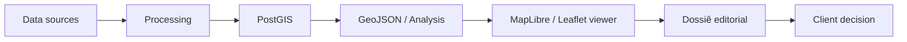

# Camões 172 — Urban Intelligence

Territorial intelligence workflow for real-estate decision-making.

## At a glance

| Item | Summary |
| --- | --- |
| Territory | Camões 172 |
| Goal | Translate territory into a product and scale decision |
| Main output | WebGIS viewer + editorial dossier |
| 2D engine | Leaflet in the browser |
| Complement | MapLibre scenes for selected 3D / contextual views |
| Data base | PostGIS, GeoJSON, public datasets, OSM, LiDAR, market layers |

## What the system shows

- End-to-end territorial workflow from parcel diagnosis to final recommendation
- Integration of public spatial data, curated layers, and market signals
- Urban context, accessibility, morphology, and product potential in one reading path
- A client-ready interface that turns analysis into a decision story

## Reading path

| Stage | Focus |
| --- | --- |
| `T0` | Parcel, ownership, legal base, allowed uses, core constraints |
| `T1` | Urban insertion, accessibility, centralities, spatial context |
| `T2` | Market reading, comparables, demand, value, positioning |
| `T3` | Envelope, buildability, development potential |
| `T4` | Product scenarios, recommendation, next steps |

## End-to-end flow

1. Spatial data is organized in `PostGIS`.
2. Analysis views and export tables are published for delivery.
3. Python scripts export relevant layers to `GeoJSON` and `JSON`.
4. The browser viewer renders the 2D map in `Leaflet`.
5. Icons, colors, tooltips, and popups are handled in viewer logic.
6. The HTML dossier embeds the viewer and organizes the narrative.
7. `MapLibre` appears in complementary 3D or contextual scenes when needed.

## Viewer features

- Interactive layers by theme
- Custom markers and SVG icons
- Tooltips and popups tied to feature attributes
- Layer toggles and thematic legends
- Contextual 2D maps for territory reading
- Complementary 3D scenes when a second layer of understanding is useful

## My role

- I framed the problem and selected the layers that mattered
- I organized the project from diagnosis to recommendation
- I shaped the narrative for client presentation
- I validated that the output was legible and defensible

## Why this matters

- Urbanism
- Territory
- Cartography
- Spatial systems
- Product thinking
- Communication for decision-makers

That combination is the core value of the project.

## Suggested way to present it

> I structured Camões 172 as a territorial intelligence workflow: data goes into PostGIS, relevant layers are published and exported, the viewer renders the map in Leaflet, and the HTML dossier turns that analysis into a clear product decision narrative.

> My role was to frame the problem, curate the layers, and validate what should be shown.

## Visual references

---

Built as part of the Ombu territorial intelligence workflow for real-estate investment decisions.
