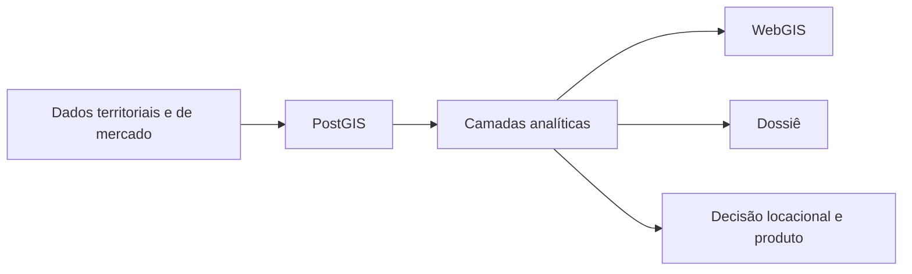

# Camões 172 · inteligência territorial aplicada

Versão em português-BR do projeto **Camões 172 — Urban Intelligence Pipeline**.

## O que este caso é

Sistema geoespacial de ponta a ponta para apoiar decisões de localização, produto e posicionamento urbano. O projeto integra dados territoriais, mercado imobiliário e regras urbanas em uma mesma estrutura analítica.

## O que este caso mostra

- integração real entre censo, território e mercado;
- base analítica em PostGIS para leitura urbana;
- transformação de dados em WebGIS e dossiê para cliente;
- uso de IBGE/SIDRA como parte do sistema, não como caso isolado.

## Visão do sistema

## Bases integradas

- GeoCuritiba / ArcGIS REST;
- IBGE SIDRA API;
- OpenStreetMap;
- LiDAR;
- listings de mercado.

## Fluxo

## Componentes principais

### Banco espacial

Separação por esquemas para ingestão, referência, análise e motor paramétrico de zoneamento.

### Engenharia de pipeline

Fluxo HOT/COLD para atualização de listings, camadas geoespaciais e artefatos analíticos.

### Integração geoespacial

Cruzamento de dados cadastrais, zoneamento, OSM, censo, LiDAR e mercado em CRS padronizado.

### WebGIS e entrega

Publicação das camadas em visualizador navegável e dossiê editorial para leitura do caso.

### Inteligência urbana e imobiliária

Leitura de cenários de produto, submercado, envelope regulatório e tensões de mercado.

## Resultado

- sistema replicável de inteligência territorial;
- leitura comparável entre território, regulação e mercado;
- apoio a avaliação de localização e desenvolvimento imobiliário.

## Ferramentas

Python · PostGIS · GeoPandas · MapLibre GL JS · GeoParquet · IBGE SIDRA API · GeoCuritiba · OSM · LiDAR

## Ver arquivos do projeto

[Abrir repositório completo](https://github.com/Manoela-Calabresi-Portfolio/camoes-172-urban-intelligence)
