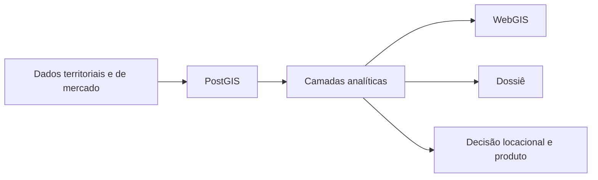

# Camões 172 · inteligência territorial aplicada

Versão em português-BR do projeto **Camões 172 — Urban Intelligence Pipeline**.

## O que este caso é

Sistema geoespacial de ponta a ponta para apoiar decisões de localização, produto e posicionamento urbano. O projeto integra dados territoriais, mercado imobiliário e regras urbanas em uma mesma estrutura analítica, organizada para virar WebGIS e dossiê de decisão.

## Pergunta central

Como transformar dados urbanos, regulatórios, censitários e de mercado em uma leitura territorial consistente para apoiar decisões imobiliárias e urbanas em um caso real.

## O que este caso mostra

- integração real entre censo, território e mercado;
- base analítica em PostGIS para leitura urbana;
- transformação de dados em WebGIS e dossiê para cliente;
- uso de IBGE/SIDRA como parte do sistema, não como caso isolado.

## Visão do sistema

## Bases integradas

- GeoCuritiba / ArcGIS REST;
- IBGE SIDRA API;
- OpenStreetMap;
- LiDAR;
- listings de mercado.

## Fluxo do sistema

## 1. Banco espacial

O banco separa ingestão, referência, análise e motor paramétrico de zoneamento em esquemas distintos. Isso permite atualizar mercado, geometrias e visões analíticas sem confundir funções ou corromper histórico.

O que este bloco entrega:

- organização robusta em PostGIS;
- separação entre dados frios, dinâmicos e derivados;
- base para regras de zoneamento e leitura analítica.

## 2. Engenharia de pipeline

O sistema opera com lógica HOT/COLD. Listings entram por pipeline próprio, com contrato de snapshot e UPSERT; camadas geoespaciais entram por reposição controlada, com dependências explicitamente recriadas.

O que este bloco entrega:

- atualização confiável de dados de mercado;
- separação entre coleta e reprocessamento;
- pipeline repetível para novos ciclos de análise.

## 3. Integração geoespacial

O caso combina fontes heterogêneas com formatos, CRS e periodicidades diferentes. Tudo entra em CRS padronizado e passa a conversar em uma mesma base espacial.

Fontes que entram aqui:

- cadastro e zoneamento municipais;
- IBGE/SIDRA para renda, domicílio e escolaridade;
- OSM para rede, POIs e edificações;
- LiDAR para modelagem de alturas;
- mercado para leitura de preço, oferta e produto.

## 4. WebGIS e entrega ao cliente

O resultado não fica só no banco. As camadas analíticas viram visualizador navegável e dossiê editorial para leitura do caso.

O que este bloco entrega:

- leitura navegável do território;
- passagem direta de análise para apresentação;
- reutilização da mesma estrutura em novos estudos.

## 5. Inteligência urbana e imobiliária

O caso transforma o território em decisão. A camada analítica avalia cenários de produto, submercado, envelope regulatório, concentração econômica e tensões frente ao mercado.

O que este bloco entrega:

- leitura comparável entre território, regulação e mercado;
- avaliação de cenários de produto;
- apoio a localização e desenvolvimento imobiliário.

## Resultado final

- sistema replicável de inteligência territorial;
- integração entre censo, mercado e geografia urbana;
- apoio a avaliação de localização, produto e desenvolvimento;
- entrega técnica e editorial no mesmo fluxo.

## Ferramentas

Python · PostGIS · GeoPandas · MapLibre GL JS · GeoParquet · IBGE SIDRA API · GeoCuritiba · OSM · LiDAR

## Ver arquivos do projeto

[Abrir repositório completo](https://github.com/Manoela-Calabresi-Portfolio/camoes-172-urban-intelligence)
